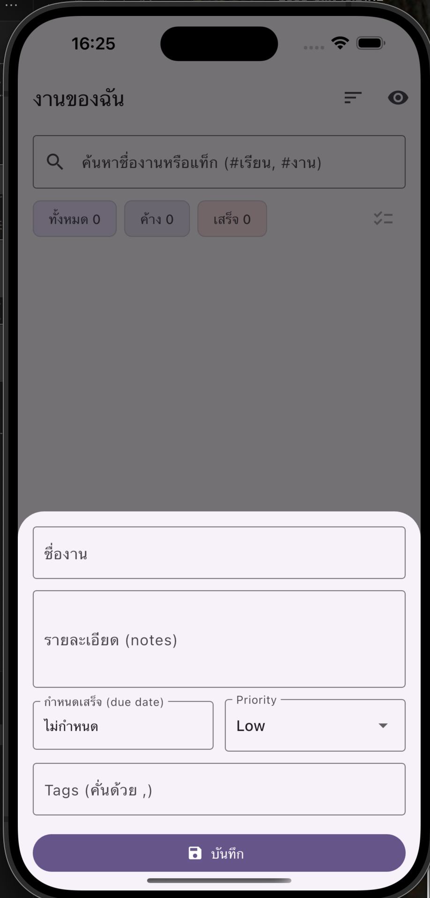
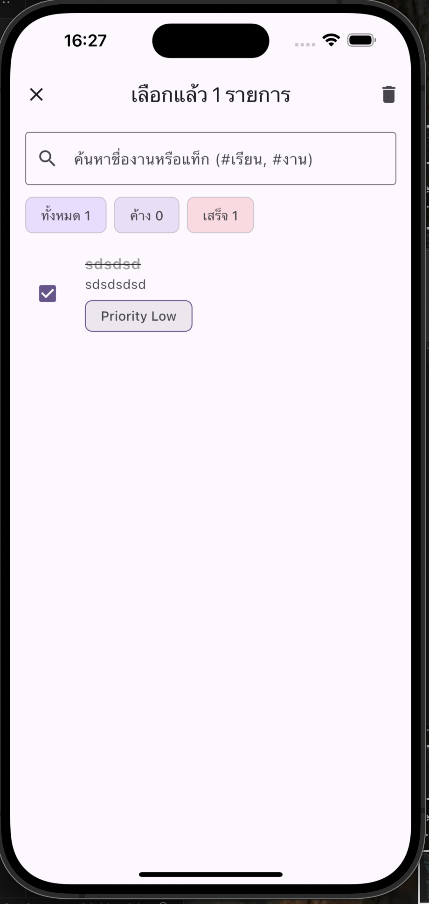

# To-Do (Provider + SQLite) — Enhanced

<p align="center">
  
  
  
</p>

Features beyond the base example:
- ✅ CRUD with Provider + SQLite (offline)
- 🔍 Search by title or tag
- 🏷️ Tags (comma-separated)
- ⏰ Due date with overdue highlight
- ⭐ Priority (Low, Medium, High)
- 📊 Stats (All / Active / Done)
- ↩️ Undo on delete (SnackBar)
- 🧹 Multi-select + bulk delete
- 🗂️ Sort by Due / Priority / Created
- 🎨 Polished UI with Material 3 and purple/white theme

## Quick start
```bash
flutter pub get
flutter run
```

## Structure
```
lib/
  main.dart
  models/
    todo.dart
  providers/
    todo_provider.dart
  services/
    todo_db.dart
  screens/
    home_screen.dart
    task_form.dart
```

---

This app is built from the base sample that uses Provider + SQLite and adds UI/UX and data model improvements for AS-08.
# todo_provider_sqlite
